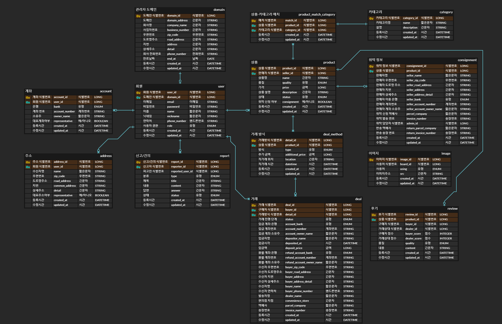

# 🗒 중고 거래 서비스
중고 거래의 위탁을 맡아주는 기업들이 있다는 가정 하에 진행되는 중고 거래 서비스입니다.

 

## 프로젝트 기능 및 설계
- ### 관리자 도메인 관리
    - 관리자 도메인 등록
        - 1, 6, 12개월 단위로 유효한 관리자 도메인을 등록할 수 있다.
        - 필요 입력정보: 도메인, 회사명, 사업자번호, 우편번호, 도로명 주소, 지번, 상세주소, 회사 전화번호, 기한(ONEYEAR(12개월), HALFYEAR(6개월), ONEMONTH(1개월) 중 선택)
        - 기업은 고유한 도메인을 가지고 있고, 일반 사용자는 관리자 도메인에 등록되어있는 도메인을 이용할 수 없다.
        - 관리자 도메인을 등록하기 전에 이미 해당 도메인을 이용하는 일반 사용자/거래 불가자가 있는 경우 지금은 기업에 종사하는 사람으로 판단, 관리자 권한으로 변경된다.
        - 관리자 권한으로 변경될 때 주소/계좌가 2개 이상 등록되어있는 경우 대표 계좌/주소 외의 정보는 삭제된다.
    - 관리자 도메인 목록 조회
        - 등록되어있는 모든 도메인 정보를 불러온다.
        - 입력 기준: 회사명 검색어, 도메인 검색어, 보이는 페이지, 한 페이지당 보이는 정보 개수, 정렬 기준, 필터
        - 검색어를 모두 입력하지 않거나 빈 칸 입력 시 등록되어있는 모든 관리자 도메인 정보를 불러온다.
        - 회사 명순(기본), 최근 등록순, 등록순, 만료일순으로 정렬 가능하다.
        - 만료, 만료 전, 전체(기본)으로 결과 필터가 가능하다.
    - 관리자 도메인 상세정보 확인
        - 식별번호에 해당하는 관리자 회사 정보와 해당 도메인에 등록된 관리자 회원 정보를 불러온다.
        - 필요 입력정보: 도메인 식별번호
        - 회원 이름순(기본), 판매 점수 높은순, 판매 점수 낮은순, 최근 가입순, 가입순으로 정렬 가능하다.
    - 관리자 도메인 갱신
        - 만료된 후 날짜를 갱신한다면 갱신하는 날짜 기준으로, 날짜가 남아있는데 갱신한다면 지정되어있는 만료 날짜를 기준으로 1, 6, 12개월 간격으로 만료되는 날짜를 늘릴 수 있다.
    - 도메인 정보 수정
        - 식별번호에 해당하는 도메인 정보를 변경할 수 있다.
        - 수정 가능 정보: 도메인, 회사명, 사업자번호, 우편번호, 도로명 주소, 지번, 상세주소, 회사 전화번호
        - 도메인 변경 시 해당 도메인을 이용하는 관리자들의 이메일 주소는 자동으로 변경된다.
        - 상세 주소를 제외한 값들은 값을 입력하지 않거나 빈 칸 입력 시 기존의 정보가 그대로 이어진다.
        - 상세 주소는 빈 칸 입력 시 빈 칸으로 등록된다. 기존 정보가 이어지길 바라면 입력값이 null 이어야 한다.
    - 도메인 삭제
        - 식별번호에 해당하는 도메인 주소를 삭제할 수 있다.
        - 이 때, 해당 도메인의 기간은 만료 상태여야 하며, 이 도메인을 사용하고 있던 관리자들은 모두 일반 사용자 권한으로 변경된다.
- ### 회원 관리
    - 회원 가입
        - 필요 정보: 이메일, 비밀번호, 이름, 닉네임, 연락처(null, 빈 값 허용)
        - 이메일은 고유해야한다.
        - 비밀번호는 반드시 영어와 숫자를 포함한 8자리 이상의 문자열이여야 하며, 암호화되어 저장된다.
        - 일반적으로 일반 사용자(USER) 권한으로 가입되지만 관리자 도메인으로 등록되어있는 메일 주소를 이용하고 있다면 관리자(ADMIN) 권한으로 가입된다.
    - 로그인
        - 로그인 시 회원가입 때 사용한 아이디와 패스워드가 일치해야 한다.
        - 관리자 권한의 이메일로 로그인 시 등록된 관리자 도메인이 유효해야 한다.
    - 정보 변경
        - 변경 가능 정보: 이름, 비밀번호, 닉네임, 연락처
        - 비밀번호를 변경하려면 기존에 등록된 비밀번호도 알맞게 입력해야한다.
        - 연락처를 제외하고 값을 입력하지 않거나 빈 칸 입력 시 기존의 정보가 그대로 이어진다.
        - 연락처는 빈 칸 입력 시 빈 칸으로 등록된다. 기존 정보가 이어지길 바라면 입력값이 null 이어야 한다.
    - 마이 페이지 조회
        - 로그인한 이용자의 상세 정보를 확인할 수 있다.
        - 조회되는 정보: 회원 식별번호, 이메일, 이름, 닉네임, 연락처, 권한, 판매 점수, 구매 점수, 판매 내역, 구매 내역
        - 점수는 완료된 거래의 후기를 통해 산출되는데, 기본 50점으로 시작하여 거래 1건 당 -2부터 +2까지 계산된다. (50 + (후기로 받은 총점의 합 - (3 * 후기 개수))) 점수는 최대 100점, 최소 0점이다.
    - 사용자 정보 조회
        - 사용자의 식별번호를 이용하여 사용자의 상세 정보를 확인할 수 있다.
        - 조회되는 정보:
            - 관리자의 식별번호일 때: 회원 식별번호, 닉네임, 권한, 판매 점수, 판매 내역, 주소, 도메인에 해당하는 회사정보
            - 일반 사용자/거래 불가자의 식별번호일 때: 회원 식별번호, 닉네임, 권한, 구매 점수, 구매 내역, 판매 점수, 판매 내역, 작성한 후기 내역
            - 관리자가 일반 사용자/거래 불가자를 조회할 땐 연락처와 이름도 조회된다.
    - 관리자 목록 조회
        - 관리자는 같은 도메인을 쓰는 관리자 목록을 이름순으로 조회할 수 있다.
        - 조회되는 정보: 회원 식별번호, 이름, 닉네임, 이메일
    - 거래 불가자 지정
        - 관리자(ADMIN)에 한하여 일반 사용자(USER)를 거래 불가자(DENIED)로 지정할 수 있다.
        - 거래 불가자로 지정되면 거래와 관련된 모든 기능을 이용할 수 없다.
    - 일반 사용자 지정
        - 관리자(ADMIN)에 한하여 거래 불가자(DENIED)를 일반 사용자(USER)로 지정할 수 있다.
    - 회원 탈퇴
        - 계정을 삭제할 수 있다. 이 때, 진행중인 거래가 없거나 담당하고 있는 위탁 정보가 없어야 한다.
- ### 회원 주소 관리
    - 주소 등록
        - 일반 사용자는 자신의 주소를 최대 5개까지 등록할 수 있다.
        - 관리자는 주소(위탁 받을 주소)를 1개만 등록할 수 있다. 일반 사용자에서 관리자로 자동 변경되어 주소를 이미 1개 이상 갖고있는 경우 더이상 주소를 등록할 수 없다.
        - 일반적으로 가장 먼저 등록된 주소가 대표 주소로 설정된다.
        - 이 때 사용자의 주소 목록에 수신인, 도로명 주소, 지번 주소, 상세주소가 모두 일치하는 주소 정보가 없어야 한다.
    - 주소 수정
        - 수정 가능 정보: 대표 주소 설정 여부, 도로명 주소, 지번 주소, 상세 주소
        - 대표 주소 설정 여부를 변경하면(false > true 로의 변경만 가능, true > false 로의 변경은 다른 주소를 대표 주소로 설정하여 변경) 기존의 대표 주소는 자동으로 해제된다.
        - 상세 주소를 제외한 값들은 값을 입력하지 않거나 빈 칸 입력 시 기존의 정보가 그대로 이어진다.
        - 상세 주소는 빈 칸 입력 시 빈 칸으로 등록된다. 기존 정보가 이어지길 바라면 입력값이 null이어야 한다.
    - 주소 삭제
        - 사용자는 자신이 등록한 주소를 삭제할 수 있다.
        - 삭제하려는 주소가 대표 주소인 경우 해당 주소를 제외하고 등록된 주소 중 가장 먼저 생성된 주소가 대표 주소로 지정된다.
    - 주소 목록 확인
        - 로그인한 사용자는 자신의 주소 목록을 확인할 수 있다.
        - 대표 주소가 가장 상단에, 이후엔 생성순으로 확인 가능하다.
- ### 회원 계좌 관리
    - 계좌 등록
        - 일반 사용자는 자신의 계좌를 최대 5개까지 등록할 수 있다.
        - 일반적으로 가장 먼저 등록된 계좌가 대표 계좌로 설정된다.
        - 이 때 등록하려는 사용자의 계좌 목록에 은행, 계좌 번호, 소유주명이 모두 일치하는 계좌 정보가 없어야 한다.
    - 계좌 수정
        - 수정 가능 정보: 대표 계좌 설정 여부, 은행, 계좌 번호, 소유주
        - 대표 계좌 설정 여부를 변경하면(false > true 로의 변경만 가능, true > false 로의 변경은 다른 계좌를 대표 계좌로 설정하여 변경) 기존의 대표 계좌는 자동으로 해제된다.
        - 값을 입력하지 않거나 빈 칸 입력 시 기존의 정보가 그대로 이어진다.
    - 계좌 삭제
        - 일반 사용자는 자신이 등록한 계좌를 삭제할 수 있다.
        - 삭제하려는 계좌가 대표 계좌인 경우 해당 계좌를 제외하고 등록된 계좌 중 가장 먼저 생성된 계좌가 대표 계좌로 지정된다.
    - 계좌 목록 확인
        - 로그인한 사용자는 자신의 계좌 목록을 확인할 수 있다.
        - 대표 계좌가 가장 상단에, 이후엔 생성순으로 확인 가능하다.
- ### 카테고리 관리
    - 카테고리 생성
        - 관리자는 상품을 분류하는 카테고리를 생성할 수 있다.
        - 필요 정보: 카테고리명, 설명
        - 카테고리명은 고유해야하며, 설명은 빈 값이 가능하다.
    - 카테고리 전체 조회
        - 생성된 카테고리의 전체 목록을 이름순(기본), 등록순, 최근 등록순으로 조회할 수 있다.
        - 조회되는 정보: 카테고리 식별번호, 카테고리명, 설명
    - 카테고리 부분 조회
        - 카테고리 식별번호에 해당하는 카테고리명, 설명을 확인할 수 있다.
        - 조회되는 정보: 카테고리 식별번호, 카테고리명, 설명
    - 카테고리 수정
        - 관리자는 기존에 등록된 카테고리를 수정할 수 있다.
        - 수정 가능 정보: 카테고리명, 설명
        - 설명은 빈 칸 입력 시 빈 칸으로 등록된다. 기존 정보가 이어지길 바라면 입력값이 null이어야 한다.
        - 카테고리명이 빈 값 혹은 null일 경우 기존 정보가 그대로 이어진다.
    - 카테고리 삭제
        - 관리자는 기존에 등록된 카테고리를 삭제할 수 있다.
        - 이 때, 카테고리에 해당하는 상품이 있을 시 카테고리 삭제는 불가하다.
    - 관리자의 카테고리별(pathValue 로 카테고리 지정) 상품 등록
        - 관리자는 이미 등록된 상품들을 카테고리에 추가할 수 있다.
        - 필요 입력 정보: 상품 식별번호(LIST 형으로 해당하는 상품의 식별번호들을 입력한다.)
    - 관리자의 카테고리별(pathValue 로 카테고리 지정) 상품 삭제
        - 관리자는 카테고리에 등록된 상품들을 해제할 수 있다.
        - 필요 입력 정보: 상품 식별번호(LIST 형으로 해당하는 상품의 식별번호들을 입력한다.)
- ### 판매 상품 관리
    - 사용자의 직접 판매 상품 등록
        - 로그인한 일반 사용자는 직접 판매할 상품을 등록할 수 있다. 이 때, 판매 유형은 직접 판매(DIRECT)와 위탁 판매(CONSIGNMENT)로 나뉜다.
        - 계좌 번호가 등록되어있지 않은 사람은 상품을 판매할 수 없다.
        - 관련된 이미지도 최대 5장까지 등록 가능하다.
            - 이미지를 등록하면 S3에 저장되고, 저장되면서 생선된 src를 DB에 등록한다.
        - 필요 입력 정보: 상품명, 가격, 상품 설명, 품질, 상품의 카테고리(상품이 해당하는 카테고리 식별번호를 LIST 형으로 입력하며, 빈 리스트를 전달할 경우 카테고리 미지정으로 카테고리별 조회에서 조회할 수 없다.)
        - 상품 등록 시 상품 상태는 판매중(SELLING) 상태로 등록되며, 거래방식 등록 전엔 상품 목록 조회가 불가하다.
    - 사용자의 위탁 판매 상품 등록
        - 로그인한 일반 사용자는 위탁 판매할 상품을 등록할 수 있다.
        - 계좌번호, 주소가 등록되어있지 않은 사람은 상품을 위탁할 수 없다.
        - 관련된 이미지도 최대 5장까지 등록 가능하다.
            - 이미지를 등록하면 S3에 저장되고, 저장되면서 생성된 src를 DB에 등록한다.
        - 필요 입력 정보: 상품명, 가격, 상품 설명, 판매자 주소 식별번호(미입력시 상품 등록자의 대표 주소 식별번호 자동입력), 판매자 계좌 식별번호(미입력시 상품 등록자의 대표 계좌 식별번호 자동 입력), 상품의 카테고리(상품이 해당하는 카테고리 식별번호를 LIST 형으로 입력하며, 빈 리스트를 전달할 경우 카테고리 미지정으로 카테고리별 조회에서 조회할 수 없다.)
        - 위탁 상품 등록 시 상품 상태는 위탁 신청(CONSIGNMENT_APPLY)로 등록된다. 이 상태로는 판매 상품 조회 시 조회되지 않는다.
    - 사용자의 판매 상품 목록 조회
        - 판매자가 자신이 판매하는 물건들의 목록을 조회할 수 있다.
        - 입력 기준: 보이는 페이지, 한 페이지당 보이는 정보 개수, 정렬 기준, 가격 필터, 카테고리 필터(카테고리 식별번호 리스트로 작성), 위탁 여부 필터
        - 조회되는 정보: 상품 식별번호, 이미지 리스트, 카테고리, 판매자(담당자) 식별번호, 상품명, 품질, 가격, 상품 설명, 판매 상태, 등록시간, 수정시간, 위탁여부
    - 판매중인 상품 목록 조회
        - 상태가 판매중(SELLING)이거나 거래진행중(PROCESSING)이고, 거래 방식이 등록되어있는 모든 상품 목록을 불러온다.
        - 입력 기준: 상품명/상품설명 검색어, 보이는 페이지, 한 페이지당 보이는 정보 개수, 정렬 기준, 품질 필터, 가격 필터, 카테고리 필터(카테고리 식별번호 리스트로 작성), 거래방식 필터(거래방식 리스트로 작성)
        - 조회 정보: 상품 식별번호, 이미지 리스트, 카테고리, 판매자(담당자) 식별번호, 상품명, 품질, 가격, 상품 설명, 해당 상품의 거래 가능 방식 종류, 등록 시간, 수정 시간
    - 상품 상세조회
        - 식별번호에 해당하는 상품의 상세 정보를 가져온다.
        - 입력 기준: 보이는 페이지(거래 방식), 한 페이지당 보이는 정보 개수(거래 방식), 거래 방식 필터
        - 조회되는 정보: 상품 정보, 거래 방식 리스트(단, 상품이 판매중/거래중이 아닌 경우 빈 리스트), 후기
    - 사용자의 판매 상품 수정
        - 사용자는 자신이 등록한 상품의 정보를 수정할 수 있다.
        - 단, 거래 진행중(PROCESSING) 상태 이전의 상태여야만 한다.
        - 수정 가능 항목: 상품명, 가격, 상품 설명, 상품의 카테고리(상품이 해당하는 카테고리 식별번호를 LIST 형으로 입력하며, 빈 리스트를 전달할 경우 카테고리 미지정으로 카테고리별 조회에서 조회할 수 없다.), 품질
        - 위탁 판매하는 상품인 경우 품질 입력값을 입력해도 변화가 없다.
        - 상품 설명은 빈 칸 입력 시 빈 칸으로 등록된다. 기존 정보가 이어지길 바라면 입력값이 null이어야 한다.
        - 카테고리는 빈 배열 입력 시 입력되었던 카테고리가 모두 삭제된다. 기존 정보가 이어지길 바라면 입력값이 null이어야 한다.
        - 나머지 정보는 빈 값 혹은 null(가격의 경우 0)일 경우 기존 정보가 이어진다.
    - 판매자의 판매 취소
        - 판매자는 본인이 직접 거래하는 상품을 판매 취소할 수 있다.
        - 상품이 거래완료되었거나 진행중인 거래가 있다면 취소가 불가하다.
    - 판매자의 상품 삭제
        - 판매자는 본인이 등록한 상품을 삭제할 수 있다.
        - 상품의 상태가 취소 상태여야만 삭제 가능하다.
- ### 위탁 상품 관리
    - 관리자의 위탁 상품 관리
        - 신청된 위탁 정보 조회
            - 담당자가 지정되지 않고, 위탁이 신청상태인 상품들의 목록을 확인할 수 있다.
        - 위탁 담당 설정
            - 위탁 신청 온 상품의 담당자로 자신의 식별번호를 등록한다.
            - 담당자는 반드시 주소가 등록되어 있어야 한다.
            - 이 때, 담당자는 비어있어야 한다.
            - 담당자가 배정되면 위탁 승인 상태(CONSIGNMENT_APPROVED) 상태가 된다.
        - 위탁 담당 변경
            - 필요 정보: 위탁 정보 식별번호, 변경할 관리자의 식별번호
            - 변경할 관리자의 이메일 도메인이 현재 로그인중인 담당자와 같아야 한다.
            - 담당자는 반드시 주소가 등록되어 있어야 한다.
        - 자신이 담당한 위탁 정보 전체 조회(상품 진행 상태로 필터 가능)
            - 담당자가 자신이 맡은 위탁 상품들의 정보를 확인할 수 있다.
            - 조회되는 정보: 위탁 정보 식별번호, 상품 식별번호, 판매자 주소, 판매자 계좌, 판매자가 위탁할 물건을 보낼 택배사, 발송 번호, 상품의 판매 상태, 반송 택배사(없을 땐 null), 반송 송장 번호
        - 자신이 담당한 위탁 정보 개별 조회
            - 필요 입력 정보: 위탁 정보 식별번호
            - 본인이 담당한 정보가 아니면 확인할 수 없다.
        - 위탁 취소 신청 조회
            - 담당자가 반송을 완료하지 않고, 취소 신청이 들어온 위탁 상품들의 정보를 확인할 수 있다.
        - 위탁 취소 반송 정보 등록
            - 담당자가 반송한 뒤 반송 정보를 입력할 수 있다.
            - 필요 정보: 반송 택배사, 반송 송장 번호
            - 이 때 반송 정보를 입력하면 상품의 상태는 취소(CANCELED)가 된다.
        - 담당한 상품 정보 변경
            - 필요 입력 정보: 이미지, 상품 식별번호, 품질
            - 담당자가 위탁 물건을 받으면 상품의 품질을 등록할 수 있다.
            - 품질을 등록하면 상품의 상태는 판매중(SELLING)으로 변경된다.
            - 담당자가 위탁 물건을 받았을 때 이미지 또한 최대 5장까지 등록할 수 있다. 단, 기존 판매자가 이미 등록한 이미지도 포함된다.
        - 거래 방식 등록
            - 거래 가능 정보들을 배열로 입력한다. 거래 방식의 유형이 동일한 정보는 여러개 등록하더라도 하나만 등록된다.
                - 객체별 필요 입력 정보: 거래 방식(택배(PARCEL), 반값 택배(CONVENIENCE) 중 선택, 추가 금액(없을 시 0 혹은 미입력)
                - 추가 금액은 배송비 등 거래 방식 별 발생하는 추가 금액이다(배송비, 포장비 등)
            - 거래 방식이 하나 이상 등록되지 않으면 상품 목록 조회 시 상품이 포함되지 않는다.
    - 판매자의 위탁 정보 등록
        - 필요 정보: 상품 식별번호, 위탁 상품을 보낼 택배사, 송장 번호
        - 담당자가 등록된 상태(상품의 위탁 승인 상태)일 때 등록할 수 있다.
    - 판매자의 위탁 정보 삭제
        - 필요 정보: 상품 식별번호
        - 자신이 등록했던 택배사와 송장번호를 삭제할 수 있다.
    - 판매자의 위탁 정보 수정
        - 필요 정보: 상품 식별번호, 변경할 택배사/송장번호, 위탁할 때 입력했던 주소 정보(식별번호)와 계좌 정보(식별번호)
        - 빈 값, null 입력 시 기존 정보가 그대로 이어진다.
    - 판매자의 상품별 위탁 정보 개별 조회
        - 필요 입력 정보: 상품 식별번호
        - 본인이 등록한 상품의 위탁 정보가 아니면 불러올 수 없다.
        - 조회되는 정보: 위탁 정보 식별번호, 상품 식별번호, 판매자 주소, 판매자 계좌, 담당자 이름, 담당자 주소, 판매자가 위탁할 물건을 보낼 택배사, 발송 번호, 상품의 판매 상태, 반송 택배사(없을 땐 null), 반송 송장 번호
    - 판매자의 위탁 취소
        - 판매자는 위탁 신청한 상품을 취소할 수 있다.
        - 이 때 발송정보가 입력되어있다면 취소 신청(CANCELED_APPLY) 상태로, 발송 정보가 입력되어있지 않다면 취소(CANCELED) 상태로 변경된다.
- ### 거래 관리
    - 구매자의 거래 신청
        - 구매를 원하는 사용자는 거래 방식을 확인하고, 가능한 거래 방식 식별번호로 거래 신청을 보낼 수 있다.
        - 주소가 등록되어있지 않은 사용자는 택배 방식의 거래를 진행할 수 없다.
        - 계좌가 등록되어있지 않은 사용자는 택배, 반값 택배 방식의 거래를 진행할 수 없다.
        - 필요 입력 정보: 거래 방식 식별 번호, 수신자 연락처
        - 거래 신청 시 거래의 상태는 신청(APPLIED) 상태가 된다.
        - 상세정보 식별번호와 구매자 식별번호의 쌍이 고유해야 한다.
        - 신청하려는 거래 방식이 택배일 경우
            - 필요 입력 정보: 환불 계좌 식별 번호(미입력 시 대표 계좌), 수신자명, 수신자 주소 식별번호(미입력시 대표 주소)
        - 신청하려는 거래 방식이 반값 택배일 경우
            - 필요 입력 정보: 환불 계좌 식별 번호(미입력시 대표 계좌), 편의점 지점, 수신자명
    - 담당자의 상품별 거래 신청 확인
        - 상품 판매를 진행하는 담당자(직접 판매인 경우 판매자, 위탁인 경우 담당자)가 상품에 들어온 신청 상태의 거래 내역 조회
        - 필요 입력 정보: 판매 식별 번호
        - 조회 정보: 거래 방식 정보, 구매자 식별번호
    - 담당자의 거래 승인
        - 필요 입력 정보: 거래 식별 번호
        - 상품의 상태가 판매중(SELLING)이고, 거래가 신청 상태인 거래 신청을 승인(APPROVED)할 수 있다.
        - 승인을 하면 상품의 상태는 거래 진행중(PROCESSING)으로 변경된다.
    - 담당자의 거래 거절
        - 필요 입력 정보: 거래 식별 번호
        - 상품의 상태가 SELLING이고, 신청 상태인 거래 신청을 거절(DENIED)할 수 있다.
    - 구매자/담당자의 거래 취소
        - 구매자/담당자는 신청, 혹은 승인 상태의 거래내역을 취소할 수 있다.
        - 필요 입력 정보: 거래 식별 번호
        - 취소 시 상품의 상태는 다시 SELLING이 되고, 거래 상태는 취소(CANCELED) 상태가 된다.
    - 구매자의 상대 정보 확인
        - 거래 상태가 승인(APPROVED)이고, 거래 방식이 택배, 혹은 반값 택배일 경우 구매자는 담당자의 계좌 목록을 조회할 수 있다.
    - 구매자의 입금 정보 입력
        - 거래 방식이 택배, 혹은 반값 택배일 경우 구매자는 입금 완료 후 입금 정보를 입력할 수 있다.
        - 필요 입력 정보: 입금 계좌 식별번호, 입금자명, 입금시각, 입금액
        - 정보 입력 시 거래 상태는 입금완료(DEPOSITED) 상태가 된다.
    - 담당자의 입금 확인
        - 담당자는 입금 완료 상태의 거래 내역을 입금 확인(CONFIRMED) 상태로 변경할 수 있다.
        - 필요 입력 정보: 거래 식별번호
    - 담당자의 상대 정보 확인
        - 담당자는 입금 완료 상태일 때 구매자의 환불 계좌 정보를 확인할 수 있다.
        - 필요 입력 정보: 거래 식별번호
    - 담당자의 거래 환불
        - 담당자는 입금 완료 상태의 거래 내역을 환불 후 환불로 변경할 수 있다.
        - 필요 입력 정보: 거래 식별 번호
        - 환불 시 상품의 상태는 다시 SELLING이 되고, 거래 상태는 환불(REFUNDED) 상태가 된다.
    - 담당자의 배송 등록
        - 담당자는 입금 확인(CONFIRMED) 상태의 거래 내역에 발송 정보를 입력할 수 있다.
        - 필요 입력 정보: 거래 식별 번호, 발송자명, (택배인 경우) 택배사, 송장 번호
        - 정보를 등록하면 거래 상태는 배송 진행중(SHIPPING)으로 변경된다.
    - 구매자의 거래 완료
        - 물건을 받은 구매자는 거래를 완료할 수 있다. 단, 택배나 반값 택배인 경우 반드시 배송 진행중 상태여야 하고 직거래는 승인 상태여야 한다.
        - 필요 입력 정보: 거래 식별 번호
        - 완료 시 거래 상태는 완료(COMPLETED) 상태가 되며, 상품 상태 또한 판매 완료(SELLED) 상태가 되고, 해당 상품을 신청했던 다른 거래 신청 내역들은 모두 취소(CANCELED) 상태가 된다.
    - 구매자의 거래 삭제
        - 구매자는 환불 또는 취소된 거래 내역을 삭제할 수 있다.
        - 필요 입력 정보: 거래 식별번호
    - 구매자의 전체 거래 내역 조회(진행 상태별 필터 가능)
        - 구매자는 자신이 거래 신청했던 모든 내역을 확인할 수 있다.
        - 조회 정보: 거래 식별번호, 상품 정보, 거래 방식 정보, 거래 진행 단계
    - 개별 거래 내역 조회
        - 담당자/구매자는 담당하거나 신청한 거래 내역을 조회할 수 있다.
        - 필요 입력 정보: 거래 식별번호
        - 조회 정보: 상품 정보, 거래 방식 정보, 거래 진행 단계, 승인된 거래의 판매 담당자 계좌 정보(택배 혹은 반값 택배일 경우), 입금 완료된 구매자 환불 정보(택배 혹은 반값 택배일 경우), 입금 완료된 구매자 주소 정보(택배일 경우), 편의점 지점(반값 택배일 경우), 발송 정보(택배, 반값 택배일 경우)
- ### 거래 방식 관리
    - 거래 방식 등록
        - 필요 입력 정보: 상품 식별 번호, 택배(PARCEL) 거래 방식(사용 여부, 추가금액), 반값 택배(CONVENIENCE) 거래 방식(사용 여부, 추가금액), 직거래(MEETING) 거래 방식(위치, 시간, 추가금액) 리스트
            - 직거래 방식에 등록하는 시간은 등록 시간으로부터 1시간 이후 시간이어야 등록 가능하다.
            - 직거래 방식의 위치, 시간의 쌍은 고유해야 한다.
            - 택배, 반값 택배는 한 번 등록하면 이후 추가로 등록할 수 없다. 입력해도 등록되지 않는다.
        - 각 거래방식별로 추가 금액 입력이 필요하다. 추가금액이 없을 시 0 혹은 미입력하면 된다. 추가 금액은 배송비 등 거래 방식 별 발생하는 추가 금액이다(배송비, 포장비 등)
        - 위탁 상품인 경우 거래를 담당한 관리자만이 등록할 수 있고, 직접 판매인 경우 상품을 등록한 사람만 등록할 수 있다.
        - 관리자는 직거래 방식을 등록할 수 없다.
    - 상품별 거래 방식 조회
        - 판매중, 거래가 진행중인 상태인 상품의 거래 방식을 조회할 수 있다.
        - 필요 입력 정보: 상품 식별 번호
        - 조회 정보: 상품 식별번호, 타입별 거래 방식(거래방식 식별번호, 추가금액, 직거래인 경우 식별번호와 추가금액과 직거래 위치와 시간을 리스트로 반환(직거래 시간 순)))
        - 단, 직거래의 경우 조회 시점 이후의 정보만 조회된다.
        - 직거래는 식별번호가 아닌 직거래 시간 순이다.
      - 거래 방식 삭제
        - 공지했던 거래 방식을 삭제할 수 있다. 단, 해당 거래 방식으로 신청중이거나 진행중인 거래가 있다면 삭제가 불가하다.
        - 필요 입력 정보: 거래 방식 식별번호
- ### 후기 관리
    - 구매자는 완료된 거래에 한해 후기를 입력할 수 있다.
    - 구매자의 후기 등록
        - 필요 입력 정보: 거래 식별번호, 거래상대 점수(1~5 정수), 품질, 내용
        - 이미지도 최대 5장까지 등록 가능하다.
    - 일반 사용자가 거래 상대일 경우 구매자가 후기를 올리면 구매자의 점수를 수정할 수 있다.
        - 필요 입력 정보: 후기 식별번호, 구매자 점수(1~5 정수)
        - 따로 수정하지 않을 시 기본 점수인 3점이다.
    - 구매자의 후기 수정
        - 필요 입력 정보: 후기 식별번호, 거래상대 점수, 품질, 내용
        - null이거나 빈 값 입력 시 기존 정보가 이어진다.
    - 구매자의 후기 삭제
        - 필요 입력 정보: 후기 식별번호
    - 상품별 후기 조회
        - 필요 입력 정보: 상품 식별번호
        - 조회 정보: 구매자 식별번호, 거래 상대 식별번호, 구매자 점수, 거래 상대 점수, 품질, 내용, 등록 시간, 수정 시간
- ### 신고/건의 관리
    - 신고/건의사항 등록
        - 사용자는 다른 사용자를 신고하거나 건의사항을 전할 수 있다.
        - 필요 입력 정보: (신고하는 경우) 신고할 대상의 식별번호, 분류(ACCUSE, SUGGEST), 제목, 내용
        - 이미지도 최대 5장까지 등록할 수 있다.
        - 등록하면 REGIST 상태로 등록된다.
    - 답변 등록
        - 관리자는 답변을 등록할 수 있다.
        - 필요 입력 정보: 신고/건의 식별번호, 답변 내용
        - 답변을 등록하면 COMPLETED로 상태가 변경된다.
        - 답변할 내용 없이 처리 완료만 하면 빈 값, null을 전달하면 된다.
    - 신고/건의사항 전체 조회
        - 일반 사용자는 자신이 등록한 신고/건의 전체 목록을 불러올 수 있다.
        - 관리자는 등록된 신고/건의 전체 목록을 조회할 수 있다.
        - 입력 정보: 보이는 페이지, 한 페이지당 보이는 정보 개수, 구분 필터(전체(기본), 신고, 건의), 상태 필터(전체(기본), 답변 전, 답변 완료), 정렬 기준(최근 등록순(기본), 등록순)
        - 리스트 내 개별 항목 조회 정보: 신고/건의 식별번호, 신고자 식별번호, 피고인 식별번호, 이미지 리스트, 분류, 제목, 상태, 등록 시간
    - 신고/건의사항 개별 조회
        - 필요 입력 정보: 신고/건의 식별번호
        - 일반 사용자는 자신이 등록한 신고/건의사항만 조회 가능하다.
        - 조회 정보: 신고/건의 식별번호, 신고자 식별번호, 피고인 식별번호, 이미지 리스트, 분류, 제목, 내용, 답변, 상태, 등록 시간, 수정 시간(답변 시간)
- ### 이미지 관리
    - 이미지 등록
        - Amazon S3을 통해 이미지를 등록한다.
        - 필요 입력정보: 사용처 식별번호, 사용처(상품(PRODUCT), 신고/건의(REPORT), 후기(REVIEW)), 등록할 이미지 파일들
        - 이 때 이미지명은 "등록시간_랜덤 문자열"로 저장된다.
    - 이미지 삭제
        - 필요 입력정보: 삭제할 이미지 식별번호 리스트
        - S3에서 DB 내 식별번호에 해당하는 이미지가 삭제된다.
        - DB에서 이미지 정보가 삭제된다.

 

## 추가 기능
위 기능들을 모두 개발한 후 시간이 된다면 차례대로 구현할 기능들입니다.

- ### 회원 관리
    - 관련 기술: , 
    - JWT 토큰을 이용, redis에 블랙리스트를 추가하는 방식으로 로그아웃  구현
    - 이메일 인증을 통해 인증한 사람만이 모든 기능 이용 가능 제한
        - 인증하지 않아도 이용 가능한 기능: 조회
- ### 상품 조회
    - 관련 기술: 
    - 기존은 카테고리, 품질, 가격으로 범위를 좁힌 후 검색하는 단어가 정확하게 상품명 혹은 상품 설명에 존재하는 모든 상품 정보를 가져오지만 ELASTIC SEARCH를 이용하여 단어 단위로, 상품명에 더 가중치를 주어 정보를 정렬하여 가져오게 변경

 

## ERD

 

## Trouble Shooting
[go to the trouble shooting section](doc/TROUBLE_SHOOTING.md)

 

### Development Environment

 
 
 
   
   
  
  

 

### Tech Stack

 
   
  
  
  
  

